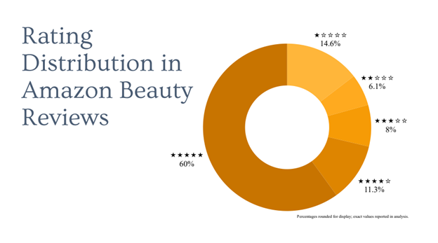
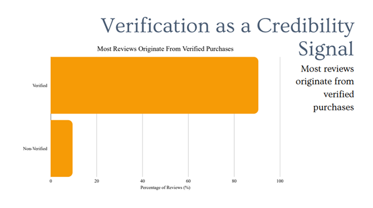
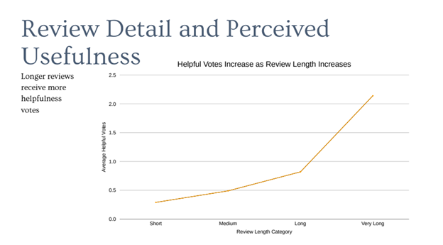

# Amazon Beauty Review Analysis

## Overview
This project analyzes Amazon beauty product reviews to understand what drives engagement and credibility.

## Goal
To identify patterns in reviews that influence helpful votes and perceived trust.

## Dataset
- Amazon Beauty Reviews dataset
- Includes ratings, review text, helpful votes, and verified purchase status

## Methods
- Data cleaning in Excel
- Pivot tables and calculated fields
- Analysis of review length, ratings, and helpful votes
- Visualization of engagement trends

## Tools Used
- Microsoft Excel

## Key Findings
- Longer reviews received more helpful votes
- Verified purchases made up the majority of reviews
- More detailed reviews tended to be perceived as more credible

## Visuals

## Status
Completed
